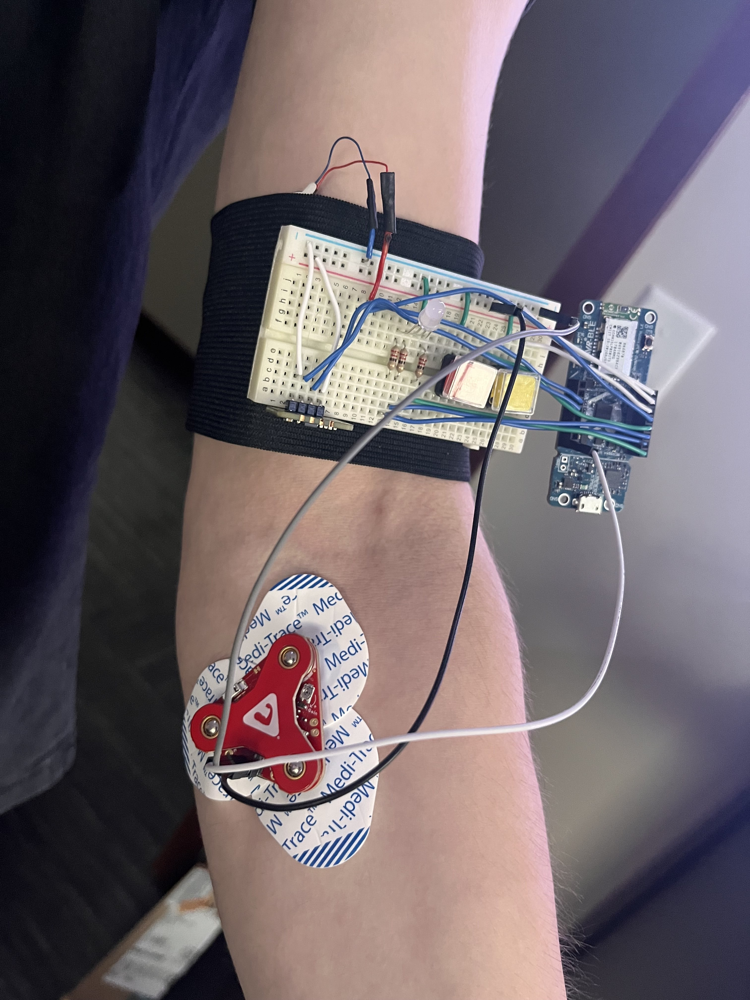

# Wearable Fitness Tracker
## Project Overview
The Wearable Fitness Tracker is a wearable device designed to assist users in monitoring workout intensity and performance. It combines real-time data from a pulse oximeter and a muscle sensor to evaluate heart rate, blood oxygen levels, and muscle engagement. This data is transmitted via Bluetooth Low Energy (BLE) to a web application, enabling users to track their exercise sessions efficiently.

## Motivation
The motivation behind this project is trying to find a better way to determine how hard someone is pushing themself while working out. I have seen a lot of people try accelerometers and force sensor to determine how hard someone is working out, but never anyone trying to look at the actual muscle. This was the goal of my project by working with the muscle sensors.

## Key Features
- **Heart Rate and Blood Oxygen Monitoring**: Uses the MAX30102 pulse oximeter for real-time heart rate and SpO2 measurement.
- **Muscle Activity Tracking**: Employs the MyoWare muscle sensor to gauge muscle engagement during exercises.
- **State-Based Operation**: Finite state machine controls device operations with intuitive feedback using a multicolor LED and a vibration motor.
- **Web-Based Interface**: BLE communication with a web application for visualizing and recording fitness data.

## Components

### [Myoware 2.0 Muscle Sensor](https://www.sparkfun.com/products/21265)
- Used for collecting the muscle data. I had to solder one three wires because I was not using a HAT with the device.

### [Vibration Motor](https://www.sparkfun.com/products/8449)
- Used for giving the user feedback to allow the user to use their hands while lifting and not for focusing on the device.

### [MAX30102 Pulse Oximeter](https://www.amazon.com/MAX30102-Detection-Concentration-Compatible-Arduino/dp/B07ZQNC8XP)
- Used for calculating the heart rate and blood oxygen of the person wearing the device

## Circuit Diagram

## Finite State Machine
The project is designed around a finite state machine with distinct states
- **ON**: Idle state awaiting user input.
- **INITIALIZATION**: Calibrates muscle sensor for baseline readings.
- **READING**: Records muscle engagement data.
- **HRBO**: Measures heart rate and blood oxygen.
- **TRANSMIT**: Sends collected data to the web application.

## Images

